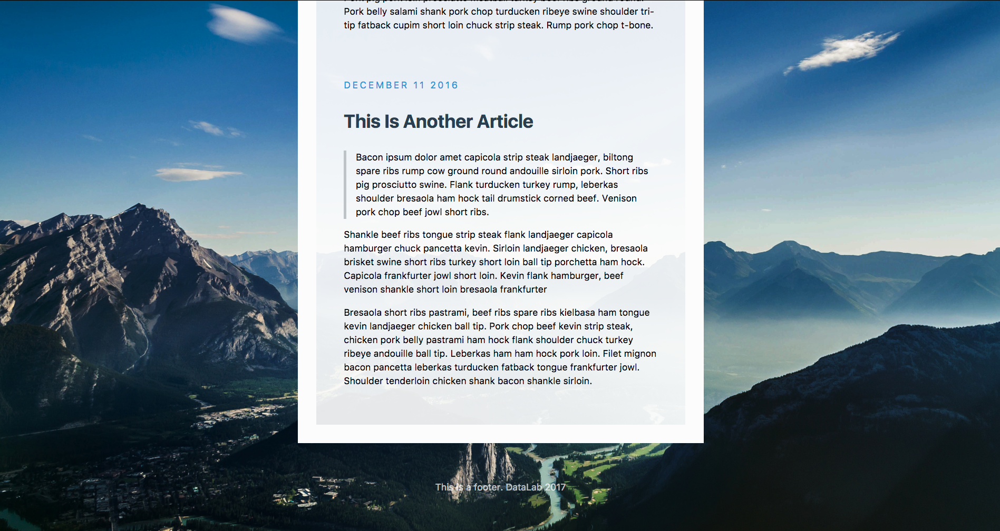
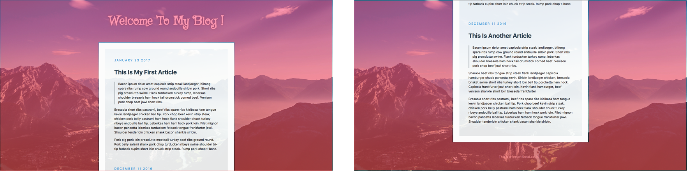
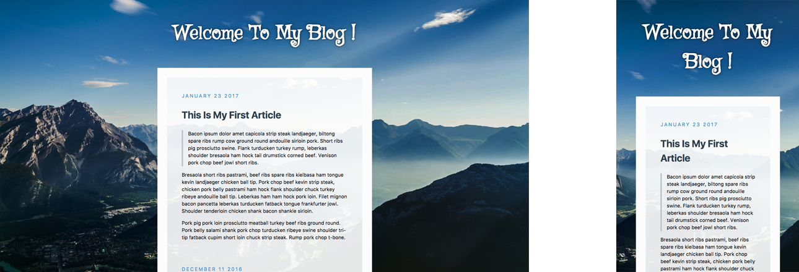
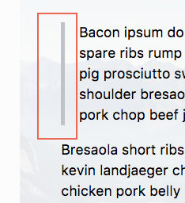
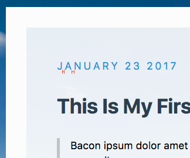
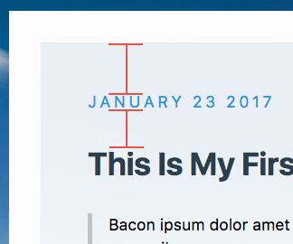

# Quiz 1 - My First Blog
  
 

## Grading

#### NOTE. Your blog page need not to be exactly the same with the example.

0. Html Title

1. Fixed centered covered Background  
  * The background image(red part) doesn't scroll along with the content.  

2. Foreground  
  * (1) Transparent foreground  
  Your article should be able to see the background image  
   
  * (2) Max-width and responsive width  
The content of the webpage should be responsive according to the window width  
  

3. Custom Header Font  
  *   

4. Article   
  * (1) Quote 
  The quote should indent with a grey line  
     
  * (2) Custom text decorations for dates and article 
  (e.g. the space between date letters, and "auto" uppercase for dates, bold title, etc.)  
     
  * (3) Spacing for the dates 
     

5. Text shadow in header and footer  
  *   

6. Rem-based sizing 
  * Increasing font size also increases spaces (10%) 
## Deadline
Submit your work before 2020/03/12 (Thu.) 23:59:59

